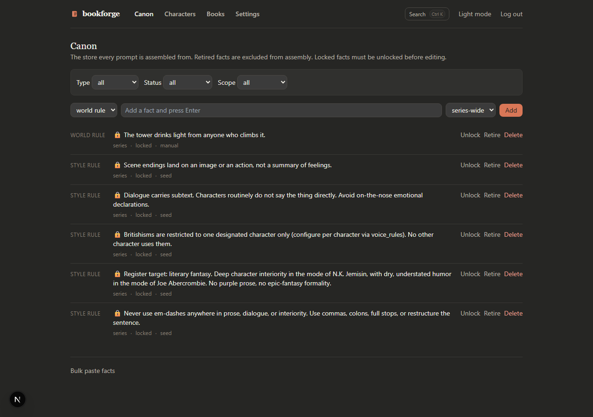
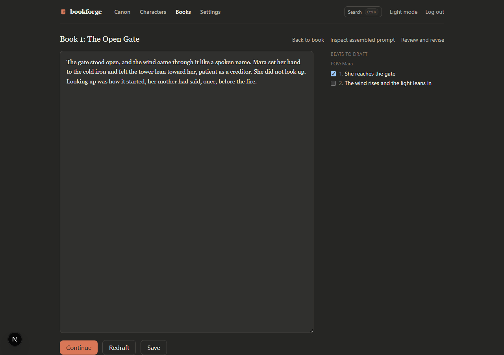
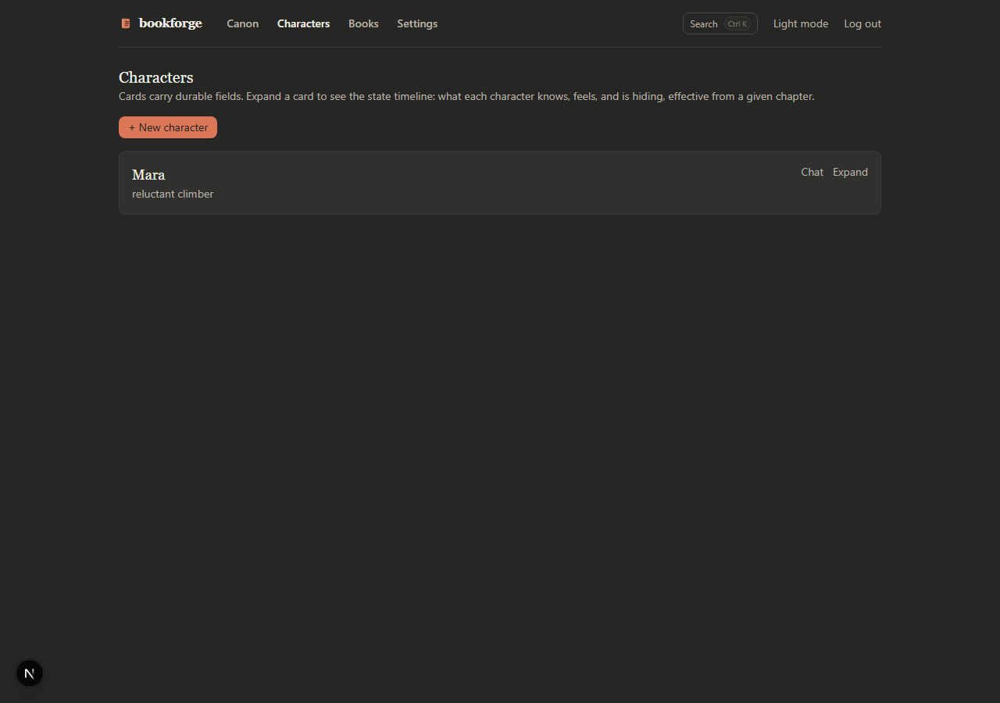
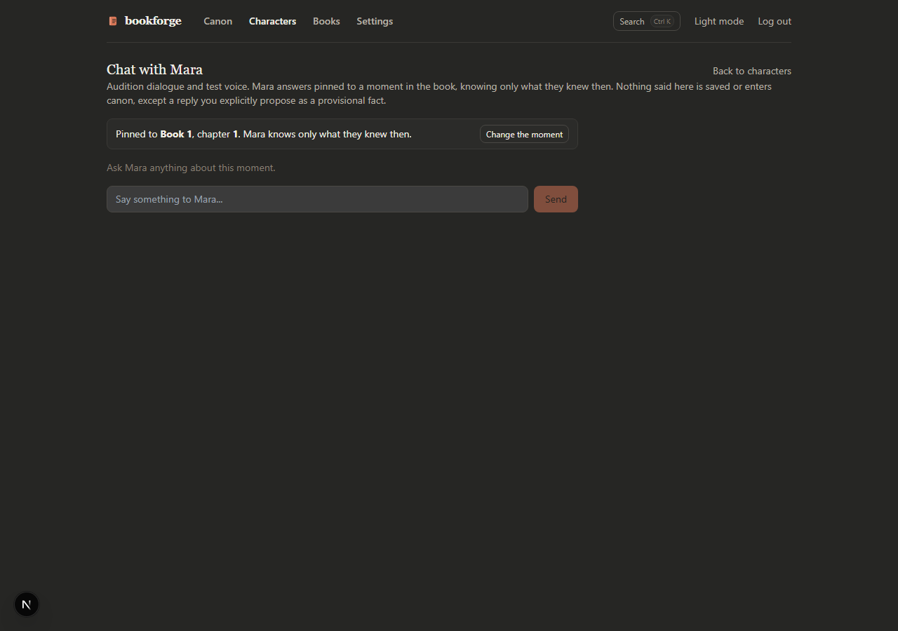

# BookForge

**AI-drafted, human-steered novel writing.** A self-hosted web app for writing long fiction where the AI drafts prose and the human holds the canon.

BookForge exists because of a specific failure mode: generate a whole novel with an LLM and, somewhere around chapter 15, the book starts contradicting itself. Character eyes change color. Dead threads resurface as live ones. The magic system quietly rewrites its own rules. The problem isn't prose quality — it's *state*. A 100,000-word novel is a large, interdependent fact-store, and a context window is not a database.

So BookForge makes the **canon store the product**. Every LLM call is assembled from it, and every chapter you approve feeds its facts back into it. Prose generation without this loop produces drift. This app is the loop.

> **Disclosure:** the first novel written with BookForge is published on Amazon — *Whatever You Do Instead of Saying Things* by S. J. Alden, a fully disclosed AI-collaborated contemporary fantasy (~92,000 words, 26 chapters). The tool was built alongside the book; the method below is the one it enforces.



## The method, in five rules

These are load-bearing. The app enforces all of them mechanically — not as conventions you can skip, but as gates in the code.

1. **Interrogate before drafting.** You don't get prose until you've answered the questions the model would otherwise improvise answers to. Ambiguity resolved up front, on the record, becomes canon.
2. **Review with inline span comments.** Read the draft; flag the exact spans that are wrong. No "make it better." A comment anchors to characters, and the revision may only touch anchored text.
3. **Revisions touch only flagged spans.** Diff-enforced. The model cannot quietly rewrite the sentences you didn't flag — the most common way AI revision degrades a page.
4. **Lock the chapter, then extract.** Approval is a deliberate act. Locked chapters yield approved facts back into the canon store (relationships, character states, threads, world rules), versioned by book and chapter.
5. **Sweep for drift, adversarially.** Consistency checks run against the canon — thread continuity, character state timelines, contradictions — before you get far enough for the drift to be load-bearing.

The design bet: **the canon store is the product.** The prose generation is almost the easy part.

## What's in the box

- **Canon manager** — typed facts (style rules, world rules, characters, threads, relationships), each with a lifecycle: `provisional → approved → locked → retired`. Locked facts can't be edited until unlocked. Series-wide and per-book scopes.
- **Sequencer + interrogation** — chapter queue with a mandatory question pass before any draft exists.
- **Context assembler** — builds each LLM call from the canon: locked style rules, character states as of the chapter being written, active thread summaries, the chapter brief. What the model sees is inspectable, not vibes.
- **Draft → review → revise loop** — streaming drafts, inline span-anchored comments, diff-enforced revision, apply-suggestions flow.
- **Lock / extract / sweep** — chapter locking with approval gates; canon extraction from approved prose; adversarial consistency sweeps.
- **Character chat** — talk to a character in their current canonical state (useful for "would she actually say this?").
- **Backfill importer** — already have a manuscript? Paste the story bible and existing chapters; BookForge scans them, proposes canon facts, and you approve what's true. This is how a book written *before* the tool gets retrofitted into it.
- **Export** — concatenated Markdown of the whole project.
- **Audio** — per-paragraph TTS (Piper/Kokoro) and STT (whisper.cpp) for read-aloud editing, both optional loopback services.
- **MCP server** — a local stdio MCP server so Claude (or any MCP client) can *read* the project: canon, characters, threads, chapters. See the hard boundary below.
- **Model choice per purpose** — put a stronger model on prose, a cheaper one on summaries. Configurable at runtime.
- **Prompt caching** across the drafting pipeline.

## The hard boundary (the part we're most proud of)

BookForge has an MCP server, and the entire design question there was: *what should an agent be allowed to do?*

Answer: read. The human-only approval gates — approving canon extractions, resolving revision hunks, locking or unlocking chapters, importing chapters — **are not exposed as MCP tools at all**. Not permission-gated: *absent*. The server never registers them, so a confused agent cannot be talked, prompted, or socially-engineered into performing one. There's a unit test asserting these tools are absent by name.

Chapter updates via MCP deliberately omit `status`/`summary` for the same reason: nothing outside the web UI can change a chapter's locked state. The agent is a reader and a drafter. The human is the editor-in-chief, structurally, not ceremonially.

```ts
// src/mcp/server.ts
// THE HARD BOUNDARY (SPEC quality bar): the human-only approval gates are NOT
// exposed as tools and must never be. ... The server does not even register such
// tools, so a confused agent cannot be talked into performing one.
```

## Screenshots

| | |
|---|---|
|  |  |
|  |  |

## Stack

Next.js 15 (App Router, TypeScript) · Tailwind CSS · SQLite via better-sqlite3 + Drizzle · @anthropic-ai/sdk (or Claude Code CLI transport) · MCP SDK · Playwright + Vitest

## Running it

```bash
git clone https://github.com/cunninghambe/bookforge
cd bookforge
npm install
cp .env.example .env.local   # set APP_PASSWORD; LLM transport per comments
npm run dev                  # http://localhost:3000
```

Auth is a single shared password (this is a single-user tool). The default LLM transport rides a locally logged-in Claude Code CLI, so local runs need no API key; set `LLM_TRANSPORT=api-key` + `ANTHROPIC_API_KEY` for server deploys (Fly.io/Docker configs in `DEPLOY.md`).

**Tests:** 448 unit + 51 e2e, `tsc --noEmit` clean.

```bash
npm test          # unit (vitest)
npx playwright test
```

## The method document

The full working method — canon schema, the interrogation protocol, the diff-enforcement rules, the sweep design, and the reasoning behind each gate — is in [`docs/METHOD.md`](docs/METHOD.md). It was written as build instructions and doubled as the authoring discipline for the published novel. If you want to know *why* the app is shaped this way, read that.

## Honesty section

- **Single-user by design.** One shared password, no accounts, no collaboration. This is a personal instrument, shared as-is.
- **Built with the tool it is.** BookForge was largely AI-built under human direction, using the same steer-and-review loop it enforces. The commit history is therefore honest rather than granular: an initial import of the working tree, then real history going forward.
- **Seed data references the author's own trilogy** (character/thread names in tests and the spec examples). They're examples of the data shape, not shipped content.
- **The repo path history includes Windows-local specifics** (see `DECISIONS.md` D1). Nothing depends on them; noted for transparency.
- **No telemetry.** Crash reporting hooks exist but point at an optional self-hosted service and are disabled unless configured.

## License

MIT — see [LICENSE](LICENSE).

*Whatever You Do Instead of Saying Things* is on Amazon Kindle: https://www.amazon.com/dp/B0HGYDVLB3
